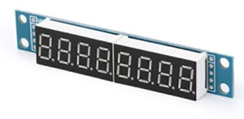

# 8 Digit 7-Segement Display (MAX7219)
makecode 8 Digit Display (MAX7219) Package for microbit  

LED Digit Display Module with 1-8 (normal eight) 7-segment LED, it can show number. It has MAX7219 chip inside, control with a 3-wire interface.  

Author: AB
Date:   Dez 2025  

## Usage

open your microbit makecode project, in Add Package, paste  

https://github.com/BolzmannSTSOE/MAX7219_7Seg_STSOE  

to search box then search.

## Modules Wiring
For the module at the head of the chain, connect it to Calliope as follows:

VCC -> 3.3V (better 5V)
GND -> GND
DIN (MOSI or MO in SPI) -> for excample C17
CS (LOAD pin) -> for excample C16
CLK (SCK in SPI) -> for excample P15
MISO or MI is not used, but included anyway for SPI pins are reassigned together.

Of course, you can reassign these SPI pins in anyway you want; just use the setup block and remember to set the correct number of matrixs.

## API

- **create(clk: DigitalPin, dio: DigitalPin, intensity: number, count: number)**  
create a MAX7219 object.
  - count - the number of digits of the module you use.
  - CS (LOAD) - Pin example C16
  - MOSI (DIN) - pin example C17
  - MISO is not used
  - SCK (CLK) - Pin example C15

- **on()**  
Turn on the display.  

- **off()**  
Turn off the display.  

- **clear()**  
Clear all digits of the display.  

- **showbit(num: number, bit: number)**  
Show a digit number at a given position [0..count-1].  

- **showNumber(num: number)**  
Show an integer number on the display.  

- **showHex(num: number)**  
Show a hex number.  

- **showDP(bit: number, show: boolean)**  
Show or hide a dot point left of a given bit.
The bit represents the dot point position, [0 .. count-1].
show=True will show DP, other will hide it  

- **intensity(dat: number)**  
set display intensity.
### WARNING: An intensity of 7 or higher can cause the SPI data transfer to be corrupted, which can lead to incorrect patterns on the display.

## Demo

## License  

MIT

## Supported targets  

* for PXT/microbit
